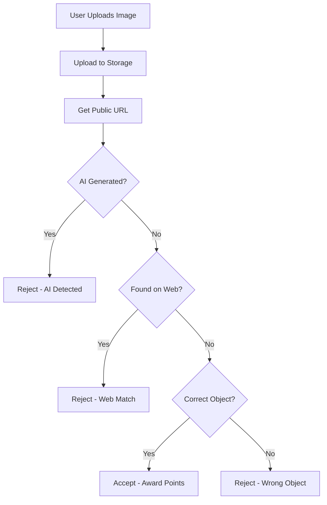

# Image-Based Hunts Guide

PeriodiQ now supports **image-based scavenger hunts** with sophisticated AI validation! Users can upload photos as clue answers, and the system validates them using three layers of detection.

## Features

### Triple Validation System

1. **AI-Generated Detection** (Sightengine API)
   - Detects if the image was created by AI
   - Rejects images with AI score > 70%
   - Ensures authentic, real-world photos

2. **Web Image Search** (Google Vision API)
   - Checks if the image exists on the web
   - Prevents users from downloading images
   - Requires original photos only

3. **Object Recognition** (Gemini API)
   - Verifies the image contains the expected object
   - Uses natural language understanding
   - Provides intelligent feedback

### Answer Types

Clues can have three answer types:
- **`text`**: Traditional typed answers
- **`image`**: Photo upload required
- **`both`**: Requires both text and image

## Setup Instructions

### 1. Database Migration

Run the image migration SQL in your Supabase project:

```bash
# In Supabase Dashboard → SQL Editor
# Copy and run: database-image-migration.sql
```

This adds:
- Image fields to `clues` and `submissions` tables
- Validation result fields
- Storage policies for image uploads
- New `image_validation_logs` table

### 2. Create Storage Bucket

In Supabase Dashboard:

1. Go to **Storage**
2. Click **New bucket**
3. Name: `hunt-images`
4. Make it **Public**
5. Click **Create**

Or run the SQL policies from the migration file.

### 3. Configure API Keys

Update your `.env.local` file:

```env
# Sightengine API - Sign up at https://sightengine.com
SIGHTENGINE_API_USER=your-user-id
SIGHTENGINE_API_SECRET=your-api-secret

# Google Vision API - Get from https://console.cloud.google.com
GOOGLE_VISION_API_KEY=your-api-key

# Gemini API - Get from https://makersuite.google.com/app/apikey
GEMINI_API_KEY=your-api-key
```

#### Getting API Keys

**Sightengine (AI Detection):**
1. Visit https://sightengine.com
2. Sign up for free account (1,000 requests/month free)
3. Go to Dashboard → API Credentials
4. Copy User ID and API Secret

**Google Vision (Web Detection):**
1. Go to https://console.cloud.google.com
2. Create/select a project
3. Enable "Cloud Vision API"
4. Create credentials → API Key
5. Copy the API key

**Gemini (Object Recognition):**
1. Visit https://makersuite.google.com/app/apikey
2. Sign in with Google account
3. Click "Create API Key"
4. Copy the generated key

## Creating Image-Based Hunts

### Example SQL

```sql
-- Create an image-based hunt
INSERT INTO hunts (title, description, difficulty, duration_minutes, start_time, end_time, status, created_by)
VALUES (
  'Photo Scavenger Hunt',
  'Capture real photos of objects around you! All images are validated for authenticity.',
  'medium',
  60,
  NOW(),
  NOW() + INTERVAL '3 hours',
  'active',
  'your-user-id'
);

-- Add image-based clues
INSERT INTO clues (hunt_id, order_number, question, expected_answer, answer_type, validation_type, points)
VALUES
  ('hunt-id', 1, 'Take a photo of a red car', 'red car', 'image', 'ai', 20),
  ('hunt-id', 2, 'Photograph a tree with visible leaves', 'tree', 'image', 'ai', 20),
  ('hunt-id', 3, 'Capture an image of a coffee cup', 'coffee cup', 'image', 'ai', 15),
  ('hunt-id', 4, 'Take a picture of a bicycle', 'bicycle', 'image', 'ai', 15);

-- Mixed answer types
INSERT INTO clues (hunt_id, order_number, question, expected_answer, answer_type, validation_type, points)
VALUES
  ('hunt-id', 5, 'What color is a lemon? (Provide answer and photo)', 'yellow', 'both', 'ai', 25);
```

### Via Admin UI (Future Feature)

When creating a hunt:
1. Select **Answer Type**: Text / Image / Both
2. For image clues, provide:
   - Clear object description
   - Optional reference image
   - Validation type (AI recommended)

## Using the Components

### In Your Hunt Page

```typescript
import ClueInterfaceEnhanced from '@/components/hunt/ClueInterfaceEnhanced';

// In your component
<ClueInterfaceEnhanced
  clue={currentClue}
  clueNumber={currentClueIndex + 1}
  totalClues={clues.length}
  participantId={participation.id}
  huntId={hunt.id}
  previousSubmission={previousSubmission}
  onSubmit={handleSubmitAnswer}
/>
```

### Submission Handler

Update your submission handler to include image data:

```typescript
const handleSubmitAnswer = async (
  answer: string,
  imageUrl?: string,
  storagePath?: string
) => {
  const submission = {
    hunt_participant_id: participation.id,
    clue_id: currentClue.id,
    answer,
    image_url: imageUrl,
    image_storage_path: storagePath,
    is_correct: false, // Will be set by validation
    points_earned: 0,
  };

  // Save to database
  const { error } = await supabase
    .from('submissions')
    .insert(submission);

  // Return result
  return { success: !error, ...validationResult };
};
```

## Validation Flow

### User Journey

1. **Upload Photo**
   - User clicks "Take/Upload Photo"
   - Selects image from device
   - Image is uploaded to Supabase Storage
   - Preview is shown

2. **AI Detection** (Automatic)
   - System sends image to Sightengine
   - Checks if AI-generated
   - If detected: Reject with feedback
   - If clean: Continue to next step

3. **Web Search** (Automatic)
   - System sends to Google Vision
   - Checks if image exists online
   - If found: Reject with feedback
   - If unique: Continue to next step

4. **Object Recognition** (Automatic)
   - System sends to Gemini
   - AI analyzes image content
   - Checks if contains expected object
   - Returns result with feedback

5. **Feedback**
   - User sees validation result
   - Correct: Points awarded
   - Incorrect: Can try again

### Technical Flow



## API Routes

### Upload Image
```
POST /api/upload-image
Content-Type: multipart/form-data

Body:
- file: Image file
- huntId: Hunt UUID
- clueId: Clue UUID

Response:
{
  "success": true,
  "imageUrl": "https://...",
  "storagePath": "user-id/hunt-id/clue-id.jpg"
}
```

### Validate Image
```
POST /api/validate-image
Content-Type: application/json

Body:
{
  "imageUrl": "https://...",
  "expectedAnswer": "red car",
  "validationType": "ai"
}

Response:
{
  "aiGeneratedDetected": false,
  "webMatchDetected": false,
  "objectMatchDetected": true,
  "isValid": true,
  "feedback": "Great! Image contains red car.",
  "details": { ... }
}
```

## Best Practices

### For Hunt Creators

1. **Clear Instructions**
   - Specify exactly what object to photograph
   - Provide examples if possible
   - Set clear expectations

2. **Reasonable Objects**
   - Choose common, identifiable objects
   - Avoid abstract concepts
   - Ensure objects are photo-ready

3. **Point Values**
   - Image clues should award more points
   - Account for effort required
   - Balance difficulty

### For Users

1. **Take Original Photos**
   - Don't download images
   - Don't use AI-generated images
   - Take fresh, authentic photos

2. **Good Photography**
   - Ensure good lighting
   - Focus on the object
   - Clear, unblurred images

3. **Correct Objects**
   - Match the description exactly
   - Show the full object
   - Avoid ambiguous photos

## Troubleshooting

### Images Being Rejected

**Problem**: Valid photo rejected as AI-generated
- **Solution**: Ensure good lighting and natural setting
- **Tip**: Avoid overly edited or filtered photos

**Problem**: Original photo flagged as web match
- **Solution**: Take a unique angle or perspective
- **Tip**: Include personal elements (your hand, unique background)

**Problem**: Correct object not recognized
- **Solution**: Ensure object is clearly visible and centered
- **Tip**: Remove clutter from background

### API Errors

**Problem**: Sightengine quota exceeded
- **Solution**: Upgrade plan or temporarily disable AI detection
- **Fallback**: System will accept images without AI check

**Problem**: Google Vision not working
- **Solution**: Check API key and billing enabled
- **Fallback**: System will skip web detection

**Problem**: Gemini validation failing
- **Solution**: Verify API key is correct
- **Fallback**: Use `validation_type: 'keyword'` instead of 'ai'

## Cost Estimates

### Free Tier Limits

- **Sightengine**: 1,000 requests/month
- **Google Vision**: 1,000 requests/month
- **Gemini**: 60 requests/minute (free)
- **Supabase Storage**: 1GB (free tier)

### For 100 Users/Month

Assuming average 5 image clues per hunt:
- 500 validation requests
- ~50MB storage
- **Cost**: Free tier sufficient

### For 1,000 Users/Month

- 5,000 validation requests
- ~500MB storage
- **Cost**: ~$15-20/month

## Migration from GS System

Your original Google Apps Script system has been fully integrated:

| GS Feature | PeriodiQ Equivalent |
|-----------|-------------------|
| Google Drive upload | Supabase Storage |
| Passcode auth | User authentication |
| Sightengine AI detection | ✅ Same API |
| Google Vision web search | ✅ Same API |
| Gemini object recognition | ✅ Same API |
| Google Sheets backend | Supabase PostgreSQL |
| Time tracking | Built-in timer |
| Ranking generation | Automatic leaderboard |

## Future Enhancements

- [ ] Batch image validation
- [ ] Image compression before upload
- [ ] Multi-angle photo support
- [ ] Video clue support
- [ ] Real-time collaborative hunts
- [ ] Hunt creation UI
- [ ] Image moderation dashboard

---

**Need Help?** Check the main [README.md](README.md) or create an issue on GitHub.
